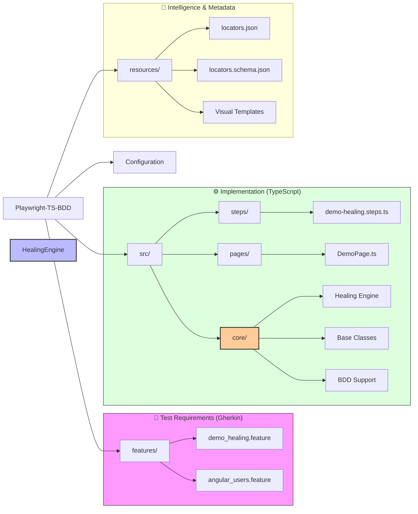

# 📚 Playwright‑TS‑BDD Framework Overview

This document combines the interactive **Mermaid map** and a plain‑text **ASCII tree** so it works in any markdown viewer (GitHub, VS Code, slide decks, etc.).

---

## �️ Interactive Mermaid Diagram



---

## � ASCII Tree (fallback when Mermaid isn’t rendered)

```
Playwright‑TS‑BDD
├─ features/
│  ├─ demo_healing.feature
│  └─ angular_users.feature
├─ src/
│  ├─ steps/
│  │  └─ demo‑healing.steps.ts
│  ├─ pages/
│  │  └─ DemoPage.ts
│  └─ core/
│     ├─ Healing Engine
│     ├─ Base Classes
│     └─ BDD Support
├─ resources/
│  ├─ locators.json
│  ├─ locators.schema.json
│  └─ Visual Templates
└─ Configuration (git, jest, playwright configs)
```

---

## �🚀 Execution Flow (Self‑Exploratory Path)
1. **Define** – Write a `.feature` file in `features/`.
2. **Generate** – Run `npx bddgen` to produce Playwright specs.
3. **Implement** – Add selectors in `src/pages/` (POM) and map steps in `src/steps/`.
4. **Execute** – Run `npx playwright test`. The **Healing Engine** automatically attempts recovery (DOM → Text → OCR) if a locator fails.
5. **Audit** – Review `reports/` for test results and the Healing Audit Log.

---

## 🧠 AI Integration
- **AI_PROMPT_GUIDE.md** – GPS for agents: where to add new code, naming conventions, and self‑maintenance rules.
- **.github/copilot‑instructions.md** – Law that enforces clean‑code standards (use `clickHealed`, `fillHealed`, etc.).

---

*Use this file directly in documentation, slide decks, or as a quick reference for new contributors.*
