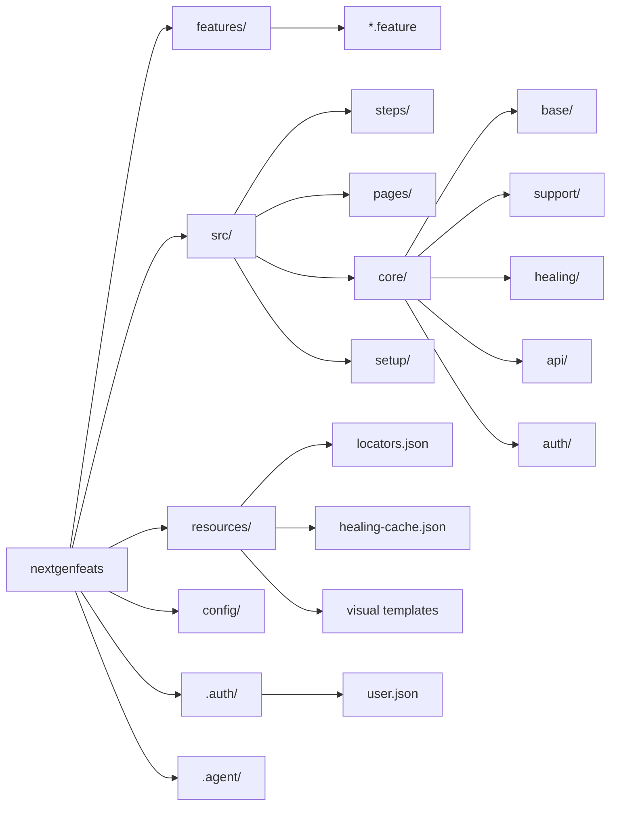

# Architecture

> **Source of truth** for the project's directory layout, what each folder does, and how the runtime pipeline connects.
> When you add or remove a top-level folder, update this file and only this file.

## What this is

`nextgenfeats` is a Playwright + Cucumber (BDD) test automation framework with a self-healing locator engine and an agent-driven authoring workflow. It targets web UIs that change frequently — selectors are repaired automatically using DOM, Visual, OCR, and LLM strategies.

## Directory layout

| Path | Role |
| ---- | ---- |
| `features/` | Gherkin `.feature` files (user-authored). |
| `.features-gen/` | Playwright spec files generated by `npx bddgen`. Do not edit. |
| `src/pages/` | Page Objects. All extend `SelfHealingBasePage`. User-authored. |
| `src/steps/` | Step definitions wiring Gherkin → page objects. User-authored. |
| `src/setup/` | Playwright `globalSetup` (delegates to `AuthCache`). |
| `src/core/` | Framework code. Modify only when changing framework behavior. |
| `src/core/base/` | `BasePage`, `SelfHealingBasePage` (abstract page abstractions). |
| `src/core/api/` | `RestApiClient` for hybrid API+UI scenarios. |
| `src/core/auth/` | `AuthCache` — single source of truth for cached `storageState`. |
| `src/core/healing/` | `HealingEngine`, `LocatorRepository`, `AuditLogger`, `HealingReporter`, `HealingUtils`, `SelfHealingPage`, plus `strategies/`. |
| `src/core/healing/strategies/` | `IHealingStrategy` interface + `Dom`, `Visual`, `Ocr`, `CustomAttribute`, `Llm` strategies. |
| `src/core/support/` | `base-step.ts` (single import surface), `fixtures.ts`, `hooks.ts`, `test-context.ts`, `logger.ts`. |
| `config/` | `testConfig.ts` master, `environments.ts` registry, `.env.UB.<env>` per-environment files. |
| `resources/` | `locators.json` (logical → selector), `locators.schema.json`, `healing-cache.json`, `recorder-script.js`, plus visual templates. |
| `recordings/` | Raw and normalized recorder JSON (output of `recorder-server.js`). |
| `scripts/` | `recorder-server.js`, `normalize-recording.js`, `convert-recording-to-feature.js`, `run-tests-with-report.js`, `open-report.js`. |
| `healing-logs/`, `logs/`, `reports/` | Generated artifacts (gitignored). |
| `.auth/` | Cached `storageState` (`user.json`). Gitignored. Managed by `AuthCache`. |
| `.agent/` | Skill manifests and agent workflows (see `docs/AGENTS.md`). |
| `docs/` | Canonical docs (this file, `COMPONENTS.md`, `CONVENTIONS.md`, `RUNNING.md`, `AGENTS.md`, `AUTHORING/`). |

## Runtime pipeline

```
features/*.feature
    │  npx bddgen
    ▼
.features-gen/*.feature.spec.{ts,js}    ◄── playwright.config.ts (testDir)
    │  npx playwright test
    ▼
reports/html-report  +  healing-logs/healing-audit.log
```

1. **`globalSetup`** runs `AuthCache.ensureFresh()` once. If `.auth/user.json` is missing or older than 29 minutes, it launches an isolated browser, runs the recorded login bypass, and persists the resulting cookies + localStorage.
2. **Worker context creation** (`src/core/support/fixtures.ts`) loads `.auth/user.json` as `storageState` if present. The framework uses one browser context + page per worker (Singleton-Page-per-worker) for speed.
3. **`BeforeAll`** (`src/core/support/hooks.ts`) loads the per-environment `.env.UB.<env>` file and calls `initializeHealing()`.
4. **`Before`** runs the auth freshness gate. If the cache expired mid-suite, `AuthCache.refresh()` regenerates state and `applyToContext()` re-injects cookies + per-origin localStorage into the live worker context.
5. **Each step** runs through `testContextStorage.enterWith(this)` so page objects can resolve the active page via `testContext`.
6. **POMs** call `clickHealed`, `fillHealed`, etc., which try the primary selector once and fall through the healing pipeline (cached → DOM → Visual → OCR → LLM) on failure. Successful repairs are persisted to `resources/locators.json` and `resources/healing-cache.json`.

## Visual map


